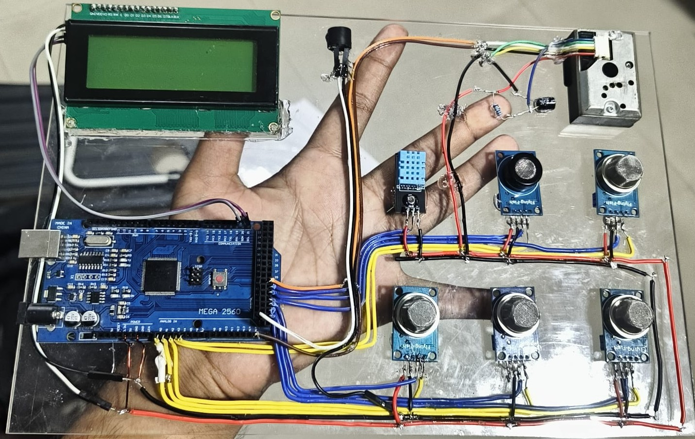

# 🌫️ Air Quality Monitoring System using Arduino Mega

Air pollution is a significant global concern, and real-time monitoring of air quality is essential to safeguard public health and the environment. This project presents the development of a **low-cost air quality monitoring system** using an **Arduino Mega microcontroller** and a set of gas and environmental sensors.

## 📌 Features

- Measures harmful gases:  
  - **Carbon Monoxide (CO)** – MQ7  
  - **Carbon Dioxide (CO₂)** – MQ135  
  - **Methane (CH₄)** – MQ4  
  - **LPG, Butane, Propane** – MQ5, MQ6  
- Monitors **temperature**, **humidity**, and **dust particles**
- **20x4 LCD display** with I2C for real-time readings
- **Buzzer alert** when gas levels exceed safe thresholds
- **Modular design** for easy customization and deployment

## 🧰 Components Used

| Component               | Purpose                              |
|------------------------|--------------------------------------|
| Arduino Mega           | Main controller                      |
| MQ5                    | LPG detection                        |
| MQ6                    | Butane & Propane detection           |
| MQ4                    | Methane detection                    |
| MQ135                  | CO₂ detection                        |
| MQ7                    | CO detection                         |
| DHT11                  | Temperature & humidity               |
| GP2Y1010AU0F           | Dust sensor                          |
| 20x4 LCD with I2C      | Real-time data display               |
| Buzzer                 | Audio alert                          |
| Breadboard & Wires     | Circuit connections                  |

## 🖥️ How It Works

1. Sensors continuously measure air quality and environmental conditions.
2. Data is displayed in real-time on the 20x4 LCD.
3. If any gas level crosses its safety threshold, the buzzer is triggered.

## 📷 Screenshots

  

## 🛠️ Installation

1. **Connect the components** as per your circuit diagram.
2. **Upload the Arduino code** using the Arduino IDE.
3. Open the serial monitor or observe the 20x4 LCD for readings.

